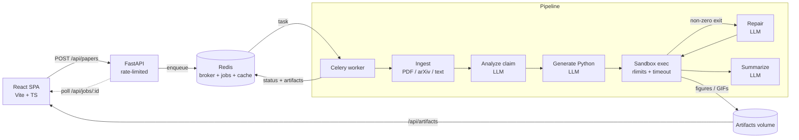

<div align="center">

# ∮ paper2sim

### Give it a math or CS paper. It writes a simulation to test the paper's claim — and runs it.

[](https://github.com/ashw1nkumars/paper2sim/actions/workflows/ci.yml)
[](https://www.python.org/)
[](https://fastapi.tiangolo.com/)
[](https://react.dev/)
[](https://docs.celeryq.dev/)
[](https://redis.io/)
[](https://www.docker.com/)
[](LICENSE)

<em>Paste an abstract, drop a PDF, or point it at an arXiv id. paper2sim extracts the central testable claim, generates a self-contained Python experiment, runs it in a sandbox, and shows you the plots, the animation, and a verdict.</em>


</div>

---

## What it does

Papers make claims. paper2sim tries to **empirically back one up** by building the experiment the paper describes and actually running it:

1. **Ingest** — read the paper from an arXiv id/URL, an uploaded PDF, or pasted text.
2. **Analyze** — an LLM extracts the single most important *testable* claim and a plan for how to test it.
3. **Generate** — the LLM writes a self-contained Python simulation targeting that plan.
4. **Execute** — the code runs in a resource-limited sandbox that produces figures / animations and a structured result. If it crashes, the error is fed back to the LLM to **repair** and retry.
5. **Summarize** — a plain-language verdict: does the simulation support the claim?

> **No API key? It still works.** With no key configured, paper2sim falls back to a deterministic **mock provider** that runs the full pipeline on a classic example (Monte Carlo estimation of π and the law of large numbers), so `docker compose up` gives you a real, rendered result out of the box.

Here is an animation the pipeline generated and ran, entirely on its own:

<div align="center">
  
</div>

---

## Quickstart

```bash
git clone https://github.com/ashw1nkumars/paper2sim.git
cd paper2sim
docker compose up --build
```

Then open **http://localhost:5173**, click **Paste text → Use a sample claim → Prove it**, and watch the stages light up.

To use a real LLM instead of the mock, add a key:

```bash
cp .env.example .env
echo "ANTHROPIC_API_KEY=sk-ant-..." >> .env
docker compose up --build
```

---

## Architecture



**Why these pieces**

| Component | Role |
|-----------|------|
| **React + Vite** | Submit papers, follow live stage-by-stage progress, view figures/animations, generated code, stdout, and the verdict. |
| **FastAPI** | Thin API: accept submissions, enqueue work, serve job state and generated artifacts. Rate-limited on the expensive submit path. |
| **Celery worker** | Runs the multi-stage pipeline off the request path so long LLM + simulation work never blocks the API. |
| **Redis** | Celery broker **and** result backend, the source-of-truth job store, the arXiv text cache, and the rate-limiter counters. |
| **Sandbox** | Runs untrusted, model-generated Python under CPU/memory/output/process limits and a wall-clock timeout. |

The LLM sits behind a one-method interface (`complete(system, user) -> str`), so providers are swappable: **Anthropic Claude** by default, with a deterministic **mock** for offline/no-key runs.

---

## Configuration

Everything has a working default (see [`.env.example`](.env.example)).

| Variable | Default | Purpose |
|----------|---------|---------|
| `LLM_PROVIDER` | `auto` | `auto` → Anthropic if a key is set, else `mock`. Force with `anthropic` / `mock`. |
| `ANTHROPIC_API_KEY` | _(empty)_ | Enables the Claude provider. |
| `ANTHROPIC_MODEL` | `claude-sonnet-5` | Model used for all stages. |
| `SANDBOX_TIMEOUT_SECONDS` | `60` | Wall-clock + CPU limit per generated script. |
| `SANDBOX_MAX_MEMORY_MB` | `2048` | Address-space cap for generated code (Linux). |
| `RATE_LIMIT_SUBMIT` | `20` | Submissions allowed per window, per client IP. |
| `RATE_LIMIT_WINDOW_SECONDS` | `3600` | Rate-limit window length. |
| `MAX_REPAIR_ATTEMPTS` | `3` | How many times a failing script is repaired and retried. |

---

## API

| Method | Path | Description |
|--------|------|-------------|
| `POST` | `/api/papers` | Submit a paper: multipart `file` (PDF), or form fields `arxiv` / `text`. Returns `{ "job_id": ... }`. Rate-limited. |
| `GET` | `/api/jobs` | List recent jobs. |
| `GET` | `/api/jobs/{id}` | Full job record: status, claim, plan, code, execution result, artifacts, verdict, summary. |
| `GET` | `/api/artifacts/{...}` | Generated figures and animations. |
| `GET` | `/api/health` | Liveness check. |

---

## Security

paper2sim **executes LLM-generated code**, so the worker sandboxes every run:

- a fresh, isolated working directory per run;
- `python -I` (isolated mode) with a stripped environment;
- POSIX rlimits on CPU time, address space, output file size, and process count;
- a wall-clock timeout that kills the process.

This is a sound trade-off for a **locally-run personal project**, but it still runs model-authored code with the worker's OS privileges. For a production/multi-tenant deployment, add a stronger layer — a container/microVM per job (gVisor, Firecracker), seccomp profiles, and blocked network egress — and run the worker as an unprivileged, disposable user. Untrusted code never runs outside the worker container.

---

## Development

```bash
# Backend
cd backend
python -m venv .venv && source .venv/bin/activate
pip install -r requirements-dev.txt
ruff check . && pytest

# Frontend
cd frontend
npm install
npm run dev      # http://localhost:5173, proxies /api to :8000
```

Or use the Makefile: `make up`, `make test`, `make lint`, `make down`.

---

## Project layout

```
paper2sim/
├── backend/
│   └── app/
│       ├── main.py            # FastAPI app, rate limiting, artifact serving
│       ├── celery_app.py      # Celery (Redis broker + backend)
│       ├── store.py           # Redis: jobs, cache, rate-limit counters
│       ├── config.py          # settings
│       ├── ingest/            # pdf / arxiv / text -> text
│       ├── llm/               # provider interface + anthropic + mock + prompts
│       ├── sandbox/           # resource-limited code executor
│       └── pipeline/tasks.py  # the ingest→…→summarize Celery task
├── frontend/                  # React + Vite + TS SPA (nginx-served)
├── docker-compose.yml
└── .github/workflows/ci.yml   # ruff + pytest + frontend build
```

---

## Roadmap

- Stream progress with SSE/WebSockets instead of polling.
- Full-PDF parsing (equations, figures) beyond the abstract.
- Container-per-job sandboxing + network egress controls.
- A gallery of interesting paper → simulation runs.

---

<div align="center">
<sub>Built with FastAPI, Celery, Redis, and React. MIT licensed.</sub>
</div>
