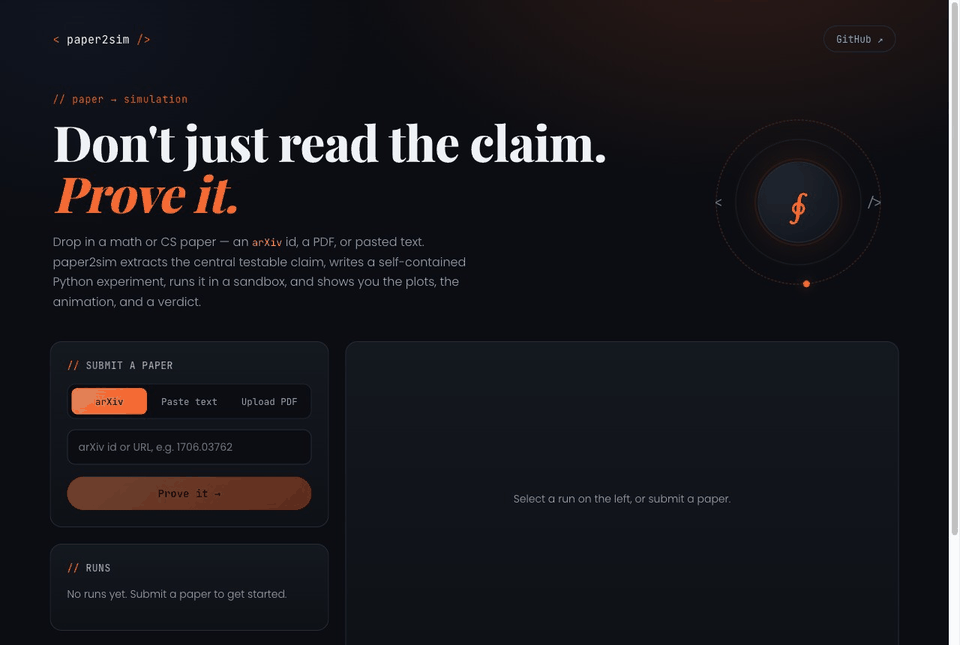
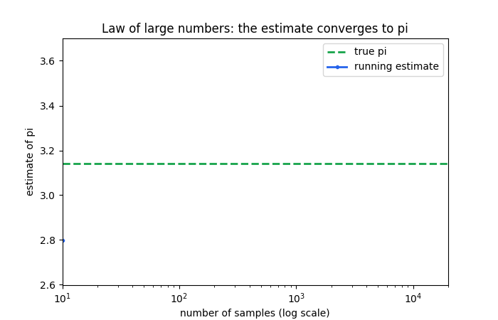
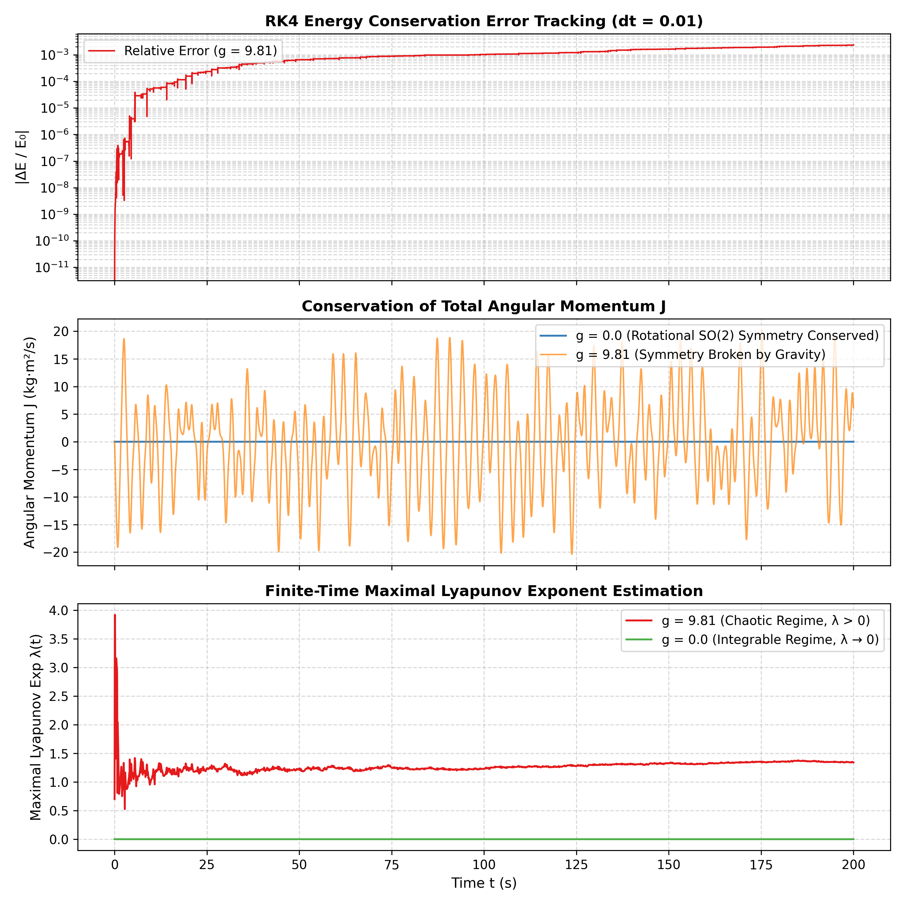
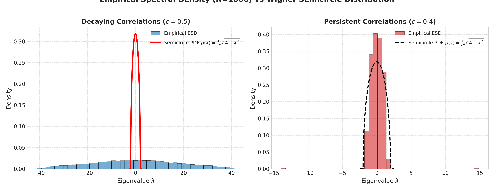
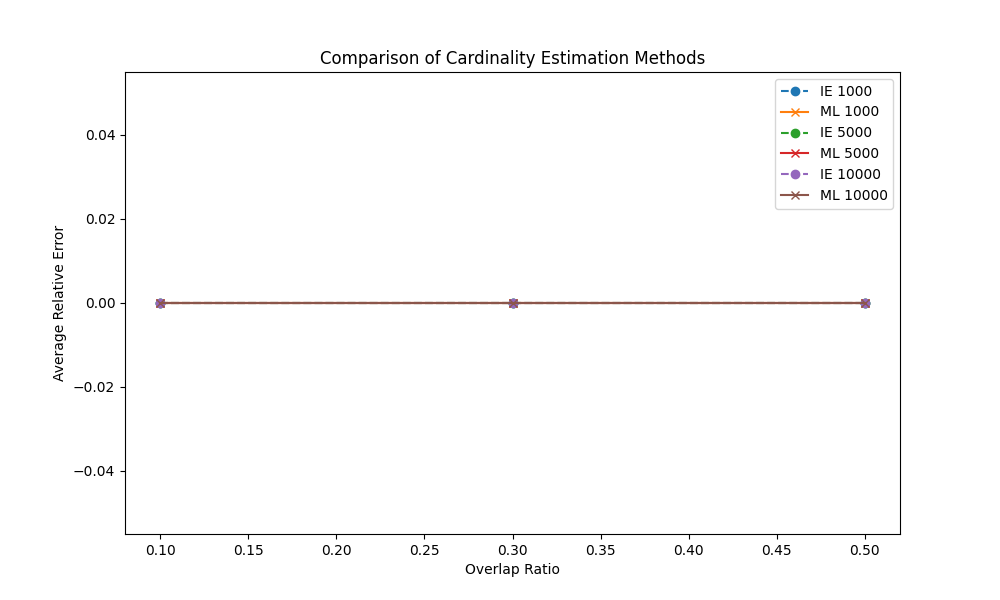
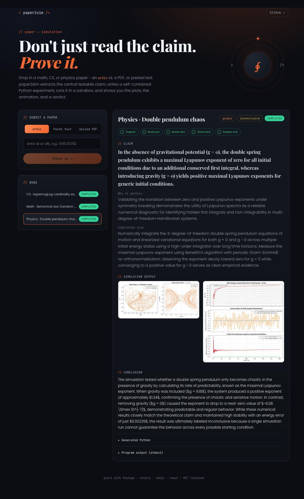
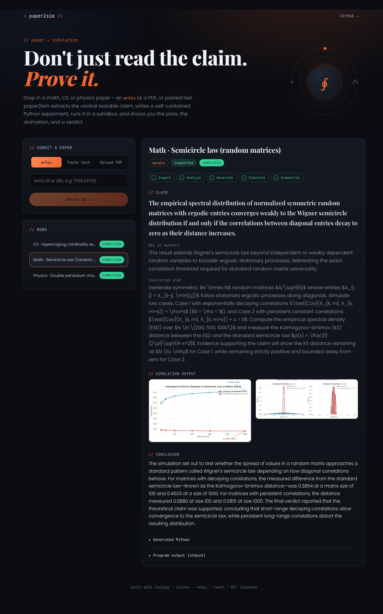
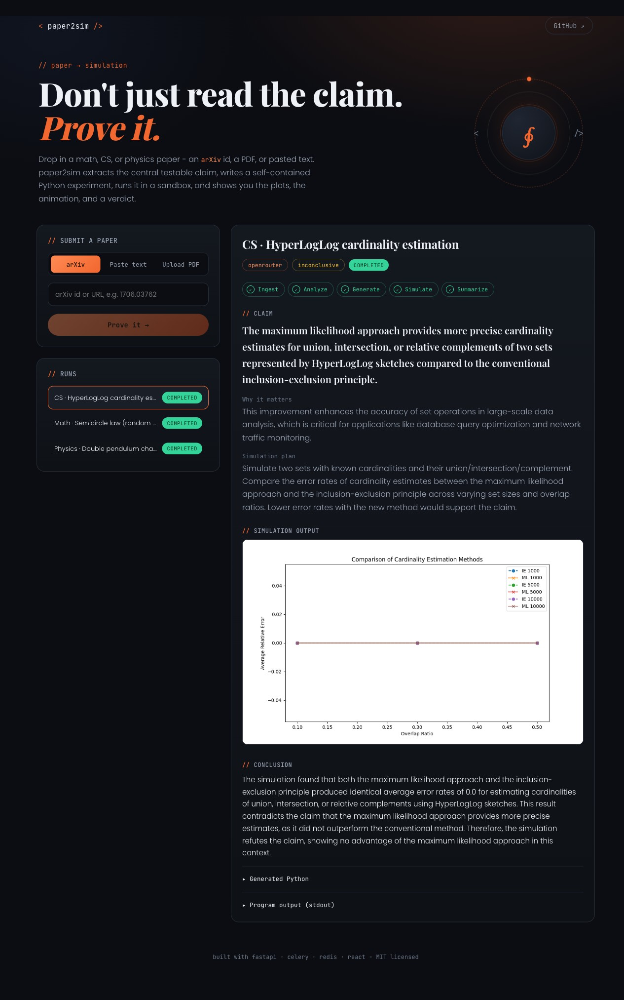
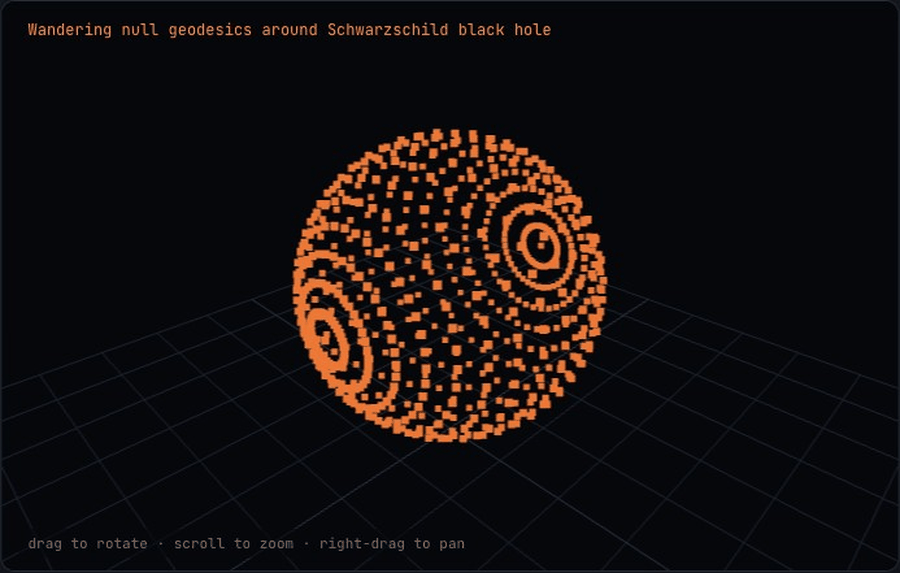
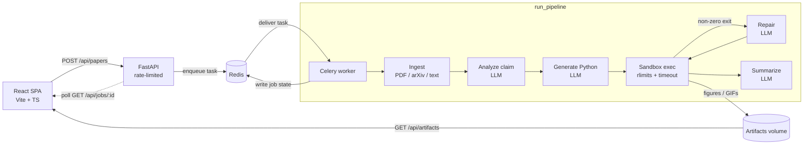

<div align="center">

# ∮ paper2sim

### Give it a math, CS, or physics paper. It writes a simulation to test the paper's claim - and runs it.

[](https://github.com/ashw1nkumars/paper2sim/actions/workflows/ci.yml)
[](https://www.python.org/)
[](https://fastapi.tiangolo.com/)
[](https://react.dev/)
[](https://docs.celeryq.dev/)
[](https://redis.io/)
[](https://www.docker.com/)
[](LICENSE)
[](CONTRIBUTING.md)
[](#contributing)

<em>Paste an abstract, drop a PDF, or point it at an arXiv id. paper2sim extracts the central testable claim, generates a self-contained Python experiment, runs it in a sandbox, and shows you the plots, the animation, and a verdict.</em>



</div>

---

## Table of contents

- [What it does](#what-it-does)
- [Real runs across math, CS, and physics](#real-runs-across-math-cs-and-physics)
- [Interactive 3D](#interactive-3d)
- [Quickstart](#quickstart)
- [How it works](#how-it-works)
- [Architecture](#architecture)
- [Job lifecycle & data model](#job-lifecycle--data-model)
- [The sandbox (security model)](#the-sandbox-security-model)
- [LLM providers](#llm-providers)
- [How Redis is used](#how-redis-is-used)
- [Rate limiting](#rate-limiting)
- [API reference](#api-reference)
- [Configuration](#configuration)
- [Frontend](#frontend)
- [Local development](#local-development)
- [Testing](#testing)
- [Continuous integration](#continuous-integration)
- [Project layout](#project-layout)
- [Security & secrets](#security--secrets)
- [Production hardening](#production-hardening)
- [Extending paper2sim](#extending-paper2sim)
- [Troubleshooting](#troubleshooting)
- [Roadmap](#roadmap)
- [Contributing](#contributing)
- [License](#license)

---

## What it does

Papers make claims. paper2sim tries to **empirically back one up** by building the experiment the paper describes and actually running it. Give it a source, and it will:

1. **Ingest** the paper (arXiv id/URL, uploaded PDF, or pasted text).
2. **Analyze** it with an LLM to extract the single most important *testable* claim and a plan for testing it.
3. **Generate** a self-contained Python simulation targeting that plan.
4. **Execute** the code in a resource-limited sandbox that produces figures / animations and a structured result - repairing and retrying if the code crashes.
5. **Summarize** the outcome in plain language: does the simulation support the claim?

It works across **mathematics, computer science, and physics**, and picks an approach that fits the field: Monte Carlo / convergence studies and `sympy` for math, algorithm implementations with measured complexity for CS, and numerical integration of equations of motion (`scipy.integrate`), dynamical / statistical / quantum systems, and conservation-law checks for physics.

Here is an animation the pipeline generated and ran, entirely on its own - a Monte Carlo estimate of π converging at the theoretical O(1/√N) rate:

<div align="center">
  
</div>

> **No API key? It still works.** With no key configured, paper2sim falls back to a deterministic **mock provider** that runs the full pipeline on a classic example (Monte Carlo π + the law of large numbers), so `docker compose up` gives you a real, rendered result out of the box. This is also what powers the CI tests.

---

## Real runs across math, CS, and physics

Three real runs, one per domain, driven live through the UI using **free** LLM providers ([Google Gemini 3.6 Flash](backend/app/llm/google.py) and [OpenRouter / DeepSeek](backend/app/llm/openrouter.py)). Each paper's central claim was extracted from its arXiv abstract, turned into a Python simulation, executed in the sandbox, and rendered with a verdict.

| Domain | Paper | Provider · model | Verdict |
|--------|-------|------------------|---------|
| ⚛️ Physics | [Dynamics and non-integrability of the double spring pendulum](https://arxiv.org/abs/2406.02200) (`nlin.CD`) | Google · gemini-3.6-flash | inconclusive |
| ∑ Math | [The semicircle law for matrices with ergodic entries](https://arxiv.org/abs/1904.00397) (`math.PR`) | Google · gemini-3.6-flash | **supported** |
| ⌨️ CS | [New cardinality estimation algorithms for HyperLogLog sketches](https://arxiv.org/abs/1702.01284) (`cs.DS`) | OpenRouter · deepseek-chat | inconclusive |

Figures the pipeline generated and ran entirely on its own:

<table>
<tr>
<td width="34%" align="center"><b>Physics</b><br/><sub>Lyapunov / energy / momentum</sub></td>
<td width="33%" align="center"><b>Math</b><br/><sub>spectral density vs semicircle</sub></td>
<td width="33%" align="center"><b>CS</b><br/><sub>cardinality-estimate error</sub></td>
</tr>
<tr>
<td></td>
<td></td>
<td></td>
</tr>
</table>

<details>
<summary><b>Full run screenshots</b> (claim, plan, figures, and conclusion for each)</summary>





</details>

> These are honest, unedited results. The verdict reflects what a short, abstract-only simulation can actually establish. The physics run, for instance, measured a positive maximal Lyapunov exponent (~1.34) with gravity and ~0 without, matching the paper, yet self-reported `inconclusive` because a single run cannot cover every initial condition.

---

## Interactive 3D

When a simulation has natural 3D structure, paper2sim renders it as a **live scene** you can **drag to rotate, scroll to zoom, and right-drag to pan**. The renderer is a fixed [three.js viewer](frontend/src/components/Scene3D.tsx) in the frontend (**no LLM**): the simulation just writes a small `scene.json` (points, lines, or trajectories) and the viewer does the rest.

Below is the real run of **"Black hole shadow and wandering null geodesics"** (arXiv [2107.06551](https://arxiv.org/abs/2107.06551)): the pipeline integrated photon geodesics winding around a Schwarzschild black hole and rendered them interactively.

<div align="center">
  
</div>

The offline **mock** provider also emits a 3D scene (a Monte-Carlo point cloud of the unit sphere), so `docker compose up` gives you an interactive 3D result with **no API key and no LLM at all**.

```json
// scene.json contract (optional artifact any run may emit)
{
  "type": "scene3d",
  "title": "Wandering null geodesics",
  "objects": [
    { "kind": "line",   "points": [[x, y, z], ...], "color": "#22d3ee" },
    { "kind": "points", "points": [[x, y, z], ...], "colors": [[r, g, b], ...], "size": 0.02 }
  ]
}
```

---

## Quickstart

**Requirements:** Docker + Docker Compose.

```bash
git clone https://github.com/ashw1nkumars/paper2sim.git
cd paper2sim
docker compose up --build
```

Open **http://localhost:5173**, click **Paste text → Use a sample claim → Prove it**, and watch the stages light up. The API is at **http://localhost:8000** (`GET /api/health` to check).

To use a real LLM instead of the mock, add a key (see [Security & secrets](#security--secrets)):

```bash
cp .env.example .env
echo "ANTHROPIC_API_KEY=sk-ant-..." >> .env   # .env is gitignored
docker compose up --build
```

---

## How it works

The heavy lifting runs in a single Celery task, [`run_pipeline`](backend/app/pipeline/tasks.py), off the request path. Each stage writes its result back to the Redis job record so the UI can follow along live.

| # | Stage | Status | What happens | Code |
|---|-------|--------|--------------|------|
| 1 | **Ingest** | `ingesting` | Turn the submission into plain text. PDFs are parsed with `pypdf`; arXiv ids/URLs are resolved to *title + abstract* via the arXiv API (cached in Redis); pasted text is used as-is. Output is trimmed to 24k chars. | [`app/ingest/`](backend/app/ingest) |
| 2 | **Analyze** | `analyzing` | The LLM returns JSON: `claim`, `why_it_matters`, `simulation_plan`. Parsed defensively (first JSON object wins; falls back to raw text as the claim). | [`prompts.ANALYZE_SYSTEM`](backend/app/llm/prompts.py) |
| 3 | **Generate** | `generating` | The LLM writes one self-contained Python script constrained to an allowlisted scientific stack and an explicit output contract. The code block is extracted from the response. | [`prompts.GENERATE_SYSTEM`](backend/app/llm/prompts.py) |
| 4 | **Execute (+ repair)** | `executing` / `repairing` | The script runs in the [sandbox](#the-sandbox-security-model). On a non-zero exit, `stderr` is fed back to the LLM to fix the code, and it retries - up to `MAX_REPAIR_ATTEMPTS` times. | [`app/sandbox/executor.py`](backend/app/sandbox/executor.py) |
| 5 | **Summarize** | `summarizing` | The LLM writes a plain-language conclusion referencing the measured numbers; the verdict is derived from the script's `RESULT_JSON`. | [`prompts.SUMMARIZE_SYSTEM`](backend/app/llm/prompts.py) |

The job ends as `completed` (script exited 0) or `failed`.

### The generated-code output contract

Generated scripts are prompted to:

- use **only** the standard library plus `numpy`, `scipy`, `sympy`, `networkx`, `pandas`, `matplotlib`, `pillow`, `imageio`;
- set matplotlib to the **Agg** backend and never call `plt.show()`;
- **seed** all randomness for reproducibility;
- save every figure to the working directory as `figure_1.png`, `figure_2.png`, … (animations as `figure_N.gif`);
- print, as the final line, exactly:

  ```
  RESULT_JSON: {"metrics": {...}, "verdict": "supported|refuted|inconclusive", "explanation": "..."}
  ```

The executor collects the figures as artifacts and parses that last line into structured metrics + a verdict.

---

## Architecture



**Services** (see [`docker-compose.yml`](docker-compose.yml)):

| Service | Image / build | Role |
|---------|---------------|------|
| `redis` | `redis:7-alpine` | Broker, result backend, job store, cache, rate limiter. |
| `backend` | `./backend` | FastAPI (uvicorn). Accepts submissions, enqueues work, serves job state + artifacts. |
| `worker` | `./backend` (same image, `celery` command) | Runs the pipeline and executes generated code. |
| `frontend` | `./frontend` | React build served by nginx, which reverse-proxies `/api` to the backend. |

The backend and worker **share one image and a `/data` volume** (uploads + artifacts), so the API can serve exactly what the worker produced. Keeping the pipeline in a worker means long LLM + simulation work never blocks the API.

**Why this split**

- **FastAPI** stays thin and fast - it never runs an LLM call or a simulation inline.
- **Celery + Redis** decouple submission from processing and give retries, time limits, and horizontal scaling (`--concurrency`, more worker replicas) for free.
- **The sandbox** is isolated to the worker, so untrusted generated code never touches the API process.

---

## Job lifecycle & data model

A submission becomes a `JobRecord` ([`app/schemas.py`](backend/app/schemas.py)) stored as JSON in Redis. Statuses progress:

```
queued → ingesting → analyzing → generating → executing ⇄ repairing → summarizing → completed
                                                                                    ↘ failed
```

`JobRecord` fields:

| Field | Type | Description |
|-------|------|-------------|
| `id` | str | 12-char job id. |
| `status` | enum | One of the statuses above. |
| `source_kind` / `source_ref` | str | `pdf`\|`arxiv`\|`text` and the filename / arXiv id. |
| `title` | str | Display title. |
| `created_at` / `updated_at` | ISO str | Timestamps. |
| `llm_provider` | str | `anthropic` or `mock`. |
| `paper_excerpt` | str | First 4k chars of the ingested text. |
| `analysis` | obj | `{ claim, why_it_matters, simulation_plan }`. |
| `code` | str | The generated Python. |
| `execution` | obj | `{ returncode, stdout, stderr, duration_seconds, artifacts[], result_json, attempt, timed_out }`. |
| `verdict` | str | `supported` \| `refuted` \| `inconclusive` \| `error`. |
| `summary` | str | Plain-language conclusion. |
| `error` | str \| null | Set if the pipeline threw. |

---

## The sandbox (security model)

paper2sim **executes LLM-generated code**, so [`executor.py`](backend/app/sandbox/executor.py) runs every script under layered constraints (defence in depth):

- a **fresh, isolated working directory** per run (`/data/artifacts/<job_id>/run_<n>/`);
- **`python -I`** (isolated mode) with a **stripped environment** - only `PATH`, `HOME` (→ the run dir), `MPLBACKEND=Agg`, `MPLCONFIGDIR`, and thread caps are passed;
- POSIX **rlimits** applied in a `preexec_fn` before exec:
  - `RLIMIT_CPU` - CPU-seconds cap;
  - `RLIMIT_AS` - address-space (memory) cap (Linux only; macOS is skipped because it over-reserves virtual memory for BLAS);
  - `RLIMIT_FSIZE` - max output file size;
  - `RLIMIT_NPROC` - process/thread cap;
- a **wall-clock timeout** (`SANDBOX_TIMEOUT_SECONDS + 5`) that kills the subprocess; the run is marked `timed_out`;
- `os.setsid()` so the child gets its own process group.

Only image/animation files produced in the run dir are collected as artifacts, and stdout/stderr are truncated before storage.

> ⚠️ **This still runs model-authored code with the worker's OS privileges.** That is an acceptable trade-off for a **locally-run personal project**, but not for a multi-tenant deployment. See [Production hardening](#production-hardening).

---

## LLM providers

Everything the pipeline needs from an LLM is one method:

```python
class LLMProvider(Protocol):
    name: str
    def complete(self, system: str, user: str) -> str: ...
```

[`get_provider()`](backend/app/llm/base.py) selects the implementation based on `LLM_PROVIDER`:

- `auto` (default) → first configured of **Anthropic** → **Groq** → **Cerebras** → **Google** → **OpenRouter**, else the **mock**;
- `anthropic` → [`AnthropicProvider`](backend/app/llm/anthropic.py) (official `anthropic` SDK, `ANTHROPIC_MODEL`);
- `groq` → [`GroqProvider`](backend/app/llm/groq.py) (fast open models, `GROQ_MODEL`);
- `cerebras` → [`CerebrasProvider`](backend/app/llm/cerebras.py) (fast open models, `CEREBRAS_MODEL`);
- `google` → [`GoogleProvider`](backend/app/llm/google.py) (Gemini via its OpenAI-compatible endpoint, `GOOGLE_MODEL`);
- `openrouter` → [`OpenRouterProvider`](backend/app/llm/openrouter.py) (many models via one API, `OPENROUTER_MODEL`);
- `mock` → [`MockProvider`](backend/app/llm/mock.py).

Groq, Cerebras, Google, and OpenRouter all share one tiny [OpenAI-compatible client](backend/app/llm/openai_compat.py) (base URL + key + model, with 429 backoff), so adding another such provider is a few lines.

The **mock** provider keys off a `TASK:` line embedded at the top of each system prompt and returns a fixed, mutually-consistent set of responses (analysis, a guaranteed-to-run simulation, and a summary) built around Monte Carlo π. Real models ignore that line. This makes the app runnable offline and makes the pipeline tests fully deterministic.

Adding a provider is a ~20-line file - see [Extending paper2sim](#extending-paper2sim).

---

## How Redis is used

Redis is the backbone; it plays **four** roles ([`app/store.py`](backend/app/store.py), [`app/celery_app.py`](backend/app/celery_app.py)):

| Role | Keys | Notes |
|------|------|-------|
| **Celery broker + result backend** | Celery-managed | Task delivery and results. |
| **Job store** (source of truth) | `paper2sim:job:{id}`, `paper2sim:jobs` (sorted set by created-at) | The API and worker are separate processes; Redis keeps job state in sync. |
| **Cache** | `paper2sim:cache:arxiv:{id}` | arXiv fetches are cached for 24h. |
| **Rate limiter** | `paper2sim:rl:{key}` | Fixed-window counters (see below). |

---

## Rate limiting

`POST /api/papers` is the expensive endpoint (it triggers LLM calls + code execution), so it is rate-limited per client IP via a Redis **fixed-window counter** ([`check_rate_limit`](backend/app/store.py)): the first request in a window `INCR`s the key and sets its TTL, so the counter self-expires. Exceeding the limit returns **HTTP 429** with a `Retry-After` header. Defaults: **20 submissions / hour** (`RATE_LIMIT_SUBMIT`, `RATE_LIMIT_WINDOW_SECONDS`).

Behind nginx, uvicorn runs with `--proxy-headers --forwarded-allow-ips=*` so the real client IP (from `X-Forwarded-For`) is used for the limit.

---

## API reference

Base URL: `http://localhost:8000` (or same-origin `/api` behind the frontend proxy).

### `POST /api/papers`
Submit a paper. `multipart/form-data` or form-encoded. Provide **one** of:

| Field | Description |
|-------|-------------|
| `file` | A PDF upload (≤ 20 MB). |
| `arxiv` | An arXiv id or URL (e.g. `1706.03762`). |
| `text` | Pasted abstract / claim. |
| `title` | *(optional)* display title. |

```bash
# arXiv
curl -F 'arxiv=1706.03762' http://localhost:8000/api/papers
# pasted text
curl -F 'text=We claim that ...' http://localhost:8000/api/papers
# PDF
curl -F 'file=@paper.pdf' http://localhost:8000/api/papers
```
Returns `{ "job_id": "abc123..." }`. Rate-limited (429 on excess).

### `GET /api/jobs`
List recent jobs (newest first).

### `GET /api/jobs/{id}`
Full [`JobRecord`](#job-lifecycle--data-model). Poll this for live progress; returns 404 if unknown.

### `GET /api/artifacts/{job_id}/run_{n}/figure_*.png|gif`
Serves generated figures/animations (paths come from `execution.artifacts`).

### `GET /api/health`
`{ "status": "ok" }`.

Interactive docs (Swagger UI) are available at `http://localhost:8000/docs`.

---

## Configuration

All settings have working defaults ([`app/config.py`](backend/app/config.py); see [`.env.example`](.env.example)). Set via environment or a gitignored `.env`.

| Variable | Default | Purpose |
|----------|---------|---------|
| `REDIS_URL` | `redis://redis:6379/0` | Redis connection (broker, backend, store, cache, limiter). |
| `CELERY_BROKER_URL` / `CELERY_RESULT_BACKEND` | *(= `REDIS_URL`)* | Override broker/backend independently. |
| `LLM_PROVIDER` | `auto` | `auto` \| `anthropic` \| `groq` \| `cerebras` \| `google` \| `openrouter` \| `mock`. |
| `ANTHROPIC_API_KEY` | *(empty)* | Enables the Claude provider. |
| `ANTHROPIC_MODEL` | `claude-sonnet-5` | Claude model used for all stages. |
| `GROQ_API_KEY` | *(empty)* | Enables the Groq provider. |
| `GROQ_MODEL` | `llama-3.3-70b-versatile` | Groq model used for all stages. |
| `CEREBRAS_API_KEY` | *(empty)* | Enables the Cerebras provider. |
| `CEREBRAS_MODEL` | `gpt-oss-120b` | Cerebras model used for all stages. |
| `GOOGLE_AI_STUDIO_API_KEY` | *(empty)* | Enables the Google Gemini provider. |
| `GOOGLE_MODEL` | `gemini-3.6-flash` | Gemini model used for all stages. |
| `OPENROUTER_API_KEY` | *(empty)* | Enables the OpenRouter provider. |
| `OPENROUTER_MODEL` | `deepseek/deepseek-chat` | OpenRouter model used for all stages. |
| `LLM_MAX_TOKENS` | `8000` | Max output tokens per LLM call. |
| `MAX_REPAIR_ATTEMPTS` | `3` | Times a failing script is repaired + retried. |
| `SANDBOX_TIMEOUT_SECONDS` | `60` | CPU + wall-clock limit per script. |
| `SANDBOX_MAX_MEMORY_MB` | `2048` | Address-space cap for generated code (Linux). |
| `SANDBOX_MAX_OUTPUT_MB` | `50` | Max size of any file the script writes. |
| `SANDBOX_MAX_PROCS` | `256` | Process/thread cap for generated code. |
| `UPLOADS_DIR` / `ARTIFACTS_DIR` | `/data/uploads`, `/data/artifacts` | Storage paths (shared volume). |
| `RATE_LIMIT_SUBMIT` | `20` | Submissions per window, per IP. |
| `RATE_LIMIT_WINDOW_SECONDS` | `3600` | Rate-limit window length. |

---

## Frontend

A single-page React + Vite + TypeScript app ([`frontend/src`](frontend/src)):

- [`SubmitForm`](frontend/src/components/SubmitForm.tsx) - tabbed input (arXiv / paste / PDF) with a one-click sample claim.
- [`JobList`](frontend/src/components/JobList.tsx) - recent runs with status badges.
- [`JobDetail`](frontend/src/components/JobDetail.tsx) - a live stage stepper, the extracted claim/plan, the generated figures gallery, the plain-language conclusion, and collapsible views of the generated code and stdout/stderr.
- [`api.ts`](frontend/src/api.ts) - a typed client using same-origin `/api` URLs.

State is kept simple: `App` **polls** `GET /api/jobs` every 3s and the selected job every 1.5s until it reaches a terminal status. In production, nginx ([`nginx.conf`](frontend/nginx.conf)) serves the static build and proxies `/api` to the backend, so there is no CORS in the deployed setup; during `npm run dev`, Vite proxies `/api` to `:8000`.

---

## Local development

**Full stack (Docker):**

```bash
docker compose up --build       # http://localhost:5173  (API on :8000)
```

**Backend only:**

```bash
cd backend
python -m venv .venv && source .venv/bin/activate
pip install -r requirements-dev.txt
# API (needs a Redis running):
uvicorn app.main:app --reload
# Worker:
celery -A app.celery_app:celery_app worker --loglevel=info
```

**Frontend only:**

```bash
cd frontend
npm install
npm run dev                     # proxies /api to http://localhost:8000
```

A [`Makefile`](Makefile) wraps the common tasks: `make up`, `make down`, `make logs`, `make test`, `make lint`, `make fmt`, `make clean`.

---

## Testing

The suite ([`backend/tests`](backend/tests)) runs against the deterministic **mock** provider, so it needs no API key and no live Redis (Redis calls are monkeypatched):

- **`test_pipeline`** - runs `run_pipeline` end-to-end and asserts the job completes, produces a `.gif` artifact, and reports `supported`. This genuinely executes the sandbox.
- **`test_sandbox`** - a valid script produces an artifact + parseable `RESULT_JSON`; an infinite loop is killed by the limits.
- **`test_api`** - submit creates a job; missing input → 400; unknown job → 404; health check.

```bash
cd backend && source .venv/bin/activate
ruff check . && pytest        # or: make test  (runs inside the image)
```

---

## Continuous integration

[`.github/workflows/ci.yml`](.github/workflows/ci.yml) runs on every push/PR:

- **backend** - `pip install`, `ruff check`, `pytest` (with `LLM_PROVIDER=mock`);
- **frontend** - `npm ci`, `npm run build` (type-checks with strict TS).

---

## Project layout

```
paper2sim/
├── backend/
│   ├── app/
│   │   ├── main.py            # FastAPI app, rate limiting, artifact serving
│   │   ├── celery_app.py      # Celery (Redis broker + backend)
│   │   ├── config.py          # pydantic-settings
│   │   ├── schemas.py         # JobRecord, Analysis, ExecutionResult, JobStatus
│   │   ├── store.py           # Redis: jobs, index, cache, rate-limit counters
│   │   ├── ingest/            # pdf.py · arxiv.py · __init__ (dispatch)
│   │   ├── llm/               # base.py · anthropic.py · mock.py · prompts.py
│   │   ├── sandbox/executor.py# resource-limited code runner
│   │   └── pipeline/tasks.py  # the ingest→…→summarize Celery task
│   ├── tests/                 # pipeline · sandbox · api
│   ├── Dockerfile · requirements*.txt · pyproject.toml
├── frontend/
│   ├── src/                   # App, api client, components, styles
│   ├── Dockerfile · nginx.conf · vite.config.ts · package.json
├── docs/                      # demo.gif + a real generated artifact
├── docker-compose.yml · Makefile · .env.example
└── .github/workflows/ci.yml
```

---

## Security & secrets

- **No secrets in the repo.** Only [`.env.example`](.env.example) is tracked, with an **empty** `ANTHROPIC_API_KEY=`. The real `.env` is gitignored.
- The API key is read **only** from environment/settings ([`config.py`](backend/app/config.py)). It is never logged, never written to a job record, and never returned by the API - responses expose only the provider *name* (e.g. `mock`).
- Uploads are capped at 20 MB; generated code cannot write files larger than `SANDBOX_MAX_OUTPUT_MB`.
- To add your key locally: `cp .env.example .env` and edit `.env` (or export `ANTHROPIC_API_KEY` in your shell / deployment secrets manager). **Never commit it.**

---

## Production hardening

This project is built to run locally. Before exposing it publicly or to untrusted users, add:

- **Stronger sandboxing** - a container/microVM per job (gVisor, Firecracker, or a disposable Docker container), seccomp profiles, a read-only root filesystem, and a non-root, unprivileged user.
- **Network egress controls** - block outbound network from the sandbox so generated code can't call out.
- **Object storage** for artifacts (S3/GCS) instead of a shared local volume.
- **Auth** on the API and per-user (not just per-IP) rate limits and quotas.
- **Observability** - structured logs, metrics, and tracing around the pipeline stages.
- **Progress streaming** - replace polling with SSE/WebSockets.

---

## Extending paper2sim

**Add an LLM provider:** create `app/llm/openai.py` implementing `complete(system, user) -> str` and a `name`, then wire it into [`get_provider()`](backend/app/llm/base.py).

**Change what "proof" means:** edit the prompts in [`app/llm/prompts.py`](backend/app/llm/prompts.py) - e.g. require statistical tests, error bars, or a specific figure set. The output contract (figures + `RESULT_JSON`) is the only thing the executor depends on.

**Full-text papers:** extend [`app/ingest/arxiv.py`](backend/app/ingest/arxiv.py) to fetch and parse the PDF instead of just the abstract.

**More libraries in the sandbox:** add them to [`requirements.txt`](backend/requirements.txt) and to the allowlist in the generate prompt.

---

## Troubleshooting

| Symptom | Likely cause / fix |
|---------|--------------------|
| Job stuck in `queued` | The worker isn't running or can't reach Redis. Check `docker compose logs worker`. |
| Every run `failed` with import errors | A generated script used a library not installed in the worker image - add it to `requirements.txt`. |
| `429 Too Many Requests` | Rate limit hit; wait for `Retry-After`, or raise `RATE_LIMIT_SUBMIT`. |
| arXiv submissions error | Network egress to `export.arxiv.org` is required by the worker; check connectivity / the id format. |
| Real LLM not used | `LLM_PROVIDER=auto` falls back to `mock` when `ANTHROPIC_API_KEY` is empty. Set the key, or `LLM_PROVIDER=anthropic`. |
| Artifacts 404 in the UI | Backend and worker must share the same `/data` volume (they do in `docker-compose.yml`). |

---

## Roadmap

- Stream progress with SSE/WebSockets instead of polling.
- Full-PDF parsing (equations, figures) beyond the abstract.
- Container-per-job sandboxing + network egress controls.
- A public gallery of interesting paper → simulation runs.

---

## Contributing

**paper2sim is open source and contributions are very welcome** - whether it's a bug fix, a new LLM provider, better prompts, sandbox hardening, docs, or a cool paper → simulation example.

- Read [`CONTRIBUTING.md`](CONTRIBUTING.md) for the dev setup, the checks to run (`ruff` + `pytest` + frontend build), and the PR flow.
- Be kind - this project follows a [Code of Conduct](CODE_OF_CONDUCT.md).
- Not sure where to start? Open an issue to discuss an idea, or look at the [Roadmap](#roadmap) and [Extending paper2sim](#extending-paper2sim).

Good first contributions: add an OpenAI/other provider, improve the analysis/generation prompts, add example runs to the gallery, or strengthen the sandbox.

## License

[MIT](LICENSE) © 2026 Ashwin Kumar - free to use, modify, and distribute.

<div align="center">
<sub>Built with FastAPI, Celery, Redis, and React.</sub>
</div>
